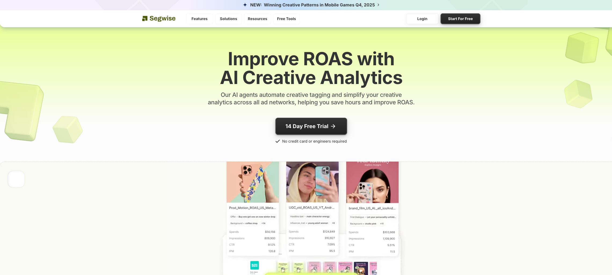

# 2026: 11 Top-Tier AI-Powered Creative Analytics Tools You Must Know

Scrolling through ad manager dashboards trying to figure out which creatives actually drive sales feels like reading tea leaves. You see spend numbers, impressions, clicks—but connecting those metrics to specific creative elements that make ads convert requires hours of manual tagging, spreadsheet wrangling, and guesswork. AI-powered creative analytics platforms automate this entire workflow by analyzing your ads frame-by-frame, identifying winning patterns across formats and audiences, and telling you exactly what to test next based on your brand's actual performance data.

## **[Segwise](https://segwise.ai)**

AI-powered creative intelligence platform built for performance teams scaling paid acquisition.

Segwise helps mobile game studios, DTC brands, subscription apps, and performance marketing agencies understand exactly which creative elements drive performance across Meta, TikTok, Google, AppLovin, and other major networks. Instead of focusing only on campaign-level metrics, the platform delivers creative-level intelligence by automatically tagging hooks, CTAs, characters, emotions, visual styles, audio components, and messaging patterns using multimodal AI.

The unified dashboard connects ad networks and MMPs into one view, eliminating manual spreadsheet consolidation and enabling cross-platform creative analysis. Teams can track ROAS, CPI, CTR, CVR, spend, and custom events by creative tag, making it clear which variables actually influence growth.

**Multimodal AI tagging** analyzes video, audio, image, text, and playable ads, mapping every tag directly to performance outcomes. This enables teams to identify scalable creative patterns, detect fatigue early, compare asset treatments through clustering, and generate new variations informed by real performance data rather than intuition.

Competitor creative tracking (currently across Meta) applies the same tagging system to rival ads, helping teams identify saturated angles and uncover white-space opportunities.

Segwise is particularly suited for high-volume advertisers where structured creative intelligence and faster iteration cycles directly impact ROAS.

## **[Foreplay](https://www.foreplay.co)**

Complete winning ad workflow combining creative research with performance reporting.

Foreplay delivers five products in one platform—ad saving, competitor tracking, creative analytics, brief building, and team collaboration tools that cover the entire creative workflow from inspiration to performance analysis. Save ads from Meta, TikTok, LinkedIn Ad Libraries, or anywhere online using the Chrome extension, building unlimited swipe files organized however your team thinks.

The ad search engine uses AI to query millions of ads from leading brands, helping you identify winning themes, hooks, and copy driving competitor success. Brief creation consolidates performance data, creative references, and specific recommendations into modular briefs that retain full context.

**Creative analytics** sync Meta, TikTok, YouTube, and LinkedIn data into visual reports comparing format performance and messaging angles. MagicAI provides automated summaries and competitor activity digests.

Foreplay particularly benefits agencies and brands needing both creative inspiration and performance tracking rather than analytics-only solutions.

## **[MagicBrief](https://magicbrief.com)**

Bridge between media buyers and creatives through visual performance insights.

MagicBrief transforms complex ad data into actionable creative insights by identifying exact elements driving performance across campaigns. Visual reports create shared language both media teams and designers understand.

Creative research tools search millions of ads to uncover proven patterns in your industry, while real-time competitor tracking shows which creative elements drive rival performance.

**Brief management** unifies performance data, references, and recommendations into one system that manages your entire content pipeline.

MagicBrief suits teams wanting comprehensive creative workflow management beyond simple analytics dashboards.

## **[Superads](https://www.superads.ai)**

Free AI-powered creative analytics focusing entirely on your own ad performance.

Superads provides deep creative analytics for your campaigns rather than tracking competitors. The platform automatically categorizes ads to identify winning products, hooks, emotional triggers, copy variations, and ad types without manual tagging.

Interactive dashboards make performance metrics accessible to designers and strategists.

Superads is particularly attractive for teams looking for affordable creative intelligence without enterprise complexity.

## **[AdSkate](https://www.adskate.com)**

AI creative intelligence platform delivering insights faster than manual analysis.

AdSkate uses AI to analyze creative performance and surface actionable recommendations tied directly to audience response patterns. The platform helps brands understand which creative elements resonate most strongly.

**AI-powered recommendations** guide next creative iterations with evidence-based suggestions.

AdSkate suits brands managing substantial advertising budgets where creative effectiveness directly impacts profitability.

## **[VidMob](https://vidmob.com)**

Creative data platform combining production, analytics, and AI-powered insights.

VidMob analyzes video and static creatives to improve brand resonance and marketing performance. AI models trained on large datasets identify patterns and provide benchmarks across industries.

The platform particularly suits enterprise brands and agencies managing large creative volumes.

## **[Madgicx](https://madgicx.com)**

Comprehensive Meta and Google advertising platform with AI-powered creative analytics.

Madgicx combines creative generation, performance analytics, and campaign optimization in one platform. Creative performance analytics identify which ad elements drive conversions.

The platform suits advertisers wanting integrated tools covering creative development through performance tracking.

## **[WASK](https://blog.wask.co)**

All-in-one platform combining AI ad creation, optimization, and competitor analysis.

WASK unifies AI ad creative generation, campaign optimization, and competitor analysis. Creative Analyze provides CTR and ROAS-based recommendations while Optimize improves budget and bid strategies automatically.

WASK particularly suits small to medium businesses wanting comprehensive advertising tools without enterprise pricing.

## **[AdCreative.ai](https://adcreative.ai)**

Conversion-focused platform generating ready-to-launch ad variants at scale.

AdCreative.ai produces ad creatives optimized specifically for conversions. Data-backed scoring evaluates creative quality before launch.

The platform benefits teams prioritizing rapid creative testing and high-volume iteration.

## **[Omneky](https://omneky.com)**

Enterprise AI creative platform with predictive analytics and brand consistency enforcement.

Omneky targets enterprises needing scalable creative generation that maintains brand voice across campaigns. Predictive scoring identifies high-performing creatives before launch.

Omneky suits organizations managing omnichannel campaigns at scale.

## **[Pencil](https://trypencil.com)**

AI ad generator learning from your performance data to improve creative recommendations.

Pencil generates ad variations based on what works in your campaigns rather than generic templates. The platform improves recommendations over time as it learns from performance data.

Pencil suits growing brands adopting AI-assisted creative workflows without enterprise complexity.

## FAQ

**How do creative analytics platforms differ from standard ad reporting dashboards?**
Standard dashboards show aggregate metrics while creative analytics platforms analyze specific creative elements to reveal which components actually drive performance.

**Can these tools analyze ads across multiple platforms simultaneously?**
Most leading platforms unify data across Meta, TikTok, Google, and other channels into centralized dashboards.

**Are creative analytics platforms worth it for smaller advertising budgets?**
Many platforms offer affordable entry tiers, making advanced analytics accessible beyond enterprise budgets.

## Unlock Your Winning Creative Patterns

Creative analytics platforms transform guesswork into data-driven creative strategy by revealing exactly which ad elements drive your conversions. Platforms like Segwise excel for teams managing substantial creative volume who need AI-powered systems that surface winning creative patterns directly from real performance data. Choose the platform aligned with your workflow priorities and let AI uncover the creative patterns currently buried in your campaigns.
